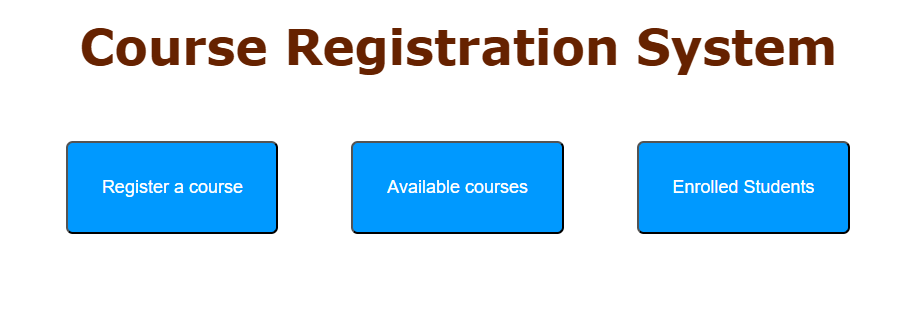
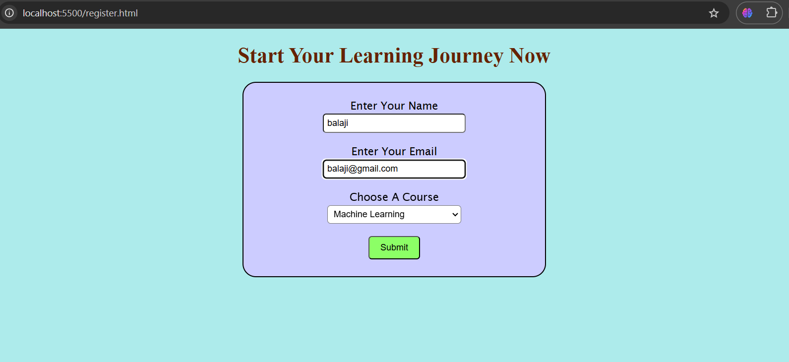
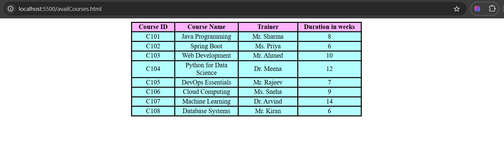
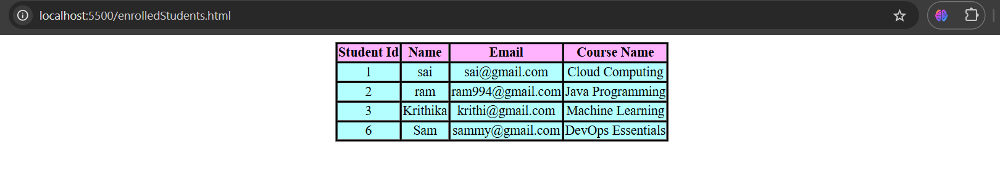

#  Course Registration Application

A full-stack course registration system that allows students to register for available courses, view enrolled student lists, and retrieve course details — built using Java Spring Boot for the backend and a simple HTML/CSS/JavaScript-based UI for the frontend.

##  Tech Stack

- **Backend**: Java, Spring Boot, MySQL, Maven, Postman  
- **Frontend**: HTML5, CSS3, JavaScript  
- **Tools**: IntelliJ IDEA, Git

##  Features

- Register a new student  
- Add and manage course details  
- Enroll a student into a course  
- Fetch available courses  
- View list of students enrolled in courses  

##  Architecture

The backend follows a layered MVC design:
Controller → Service → Repository → MySQL DB

The frontend interacts with the backend via REST APIs and displays data using basic HTML forms and tables.

##  Core Endpoints

| Method | Endpoint               | Description                          |
|--------|------------------------|--------------------------------------|
| GET    | `/courses`             | Fetch list of all available courses  |
| GET    | `/courses/enrolled`    | Fetch list of enrolled students      |
| POST   | `/courses/register`    | Register a student to a course       |

##  UI Screenshots

###  Homepage

###  Register a Course

###  Available Courses

###  Enrolled Students

##  How to Run

1. Clone this repository  
2. Configure the database in `application.properties`  
3. Run the main class `CourseRegistrationApplication.java`  
4. Test APIs via Postman or use the frontend HTML UI

